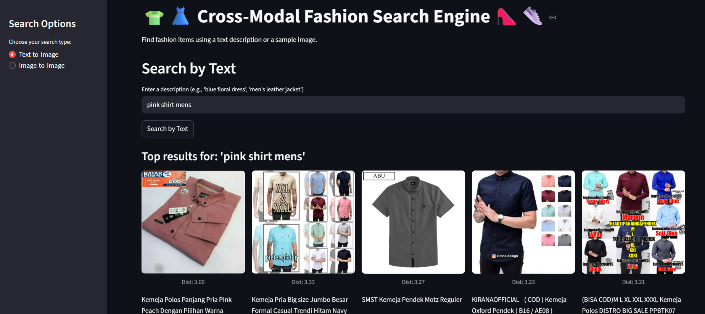
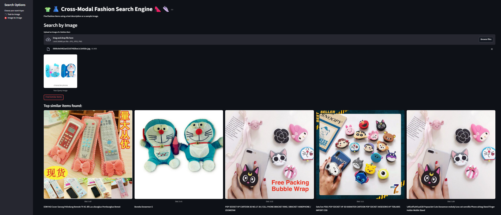

# 🛍️ Multimodal Product Search using CLIP + FAISS

This project is a **multimodal product search engine** that enables you to search Shopee product images using either **text** or **image queries**. It uses a **fine-tuned CLIP model** for encoding, and **FAISS** for fast similarity search.

---

## 📸 Demo Output

---

## 📁 Folder Structure

* shopee_clip_model/           # Extracted model folder 
* shopee_dataset/             # Contains product images from Kaggle
* app.py                      # Streamlit app (UI)
* shopee_image.index          # FAISS index (20MB)
* shopee_image_mapping.xlsx   # Mapping of image filenames to product info

---

## 🧠 Overview

- Fine-tuned **CLIP** (Contrastive Language-Image Pretraining) model learns aligned text–image embeddings.
- A **FAISS** index allows fast nearest-neighbor search.
- Users can:
  - 🔤 Enter a text query (e.g., `"red shirt"`).
  - 🖼 Upload a product image.
- System retrieves visually and semantically similar products.

---

## 📥 Dataset

**Shopee Product Matching - Kaggle**  
👉 [Kaggle competition link](https://www.kaggle.com/competitions/shopee-product-matching)  

You'll need:  
- A [Kaggle account](https://www.kaggle.com/account)  
- Your personal `kaggle.json` API key file  

---

## 🚀 Getting Started

> ⚠️ This project requires both Google Colab (for model training and indexing) and your local machine (to run the Streamlit app).

### 🧾 Step 1: Clone This Repository
- git clone https://github.com/yourusername/multimodal-search.git
- cd multimodal-search

### 🧑‍💻 Step 2: Run Colab Notebook

- Open `multimodal_search.ipynb` in Google Colab.
- Upload your `kaggle.json` when prompted.
- The notebook will:
  - Download and unzip the Shopee dataset.
  - Fine-tune the CLIP model.
  - Save the following files to download:
    - `shopee_clip_model`
    - `shopee_image.index`
    - `shopee_image_mapping.xlsx`
    - `app.py`

### 🗂 Step 3: Prepare Your Local Directory

- Ensure `shopee_dataset/` contains all product images.
- Your folder should now look like:
  - shopee_clip_model/
  - shopee_dataset/
  - shopee_image.index
  - shopee_image_mapping.xlsx
  - app.py

### 🖥️ Step 4: Run the Streamlit App

- Install Streamlit if you haven't yet:
- pip install streamlit

- Run the app:
-streamlit run app.py

- You can now search using either:
  - Text input
  - Uploaded images  
- The top 5 most similar product images will be displayed.

---

